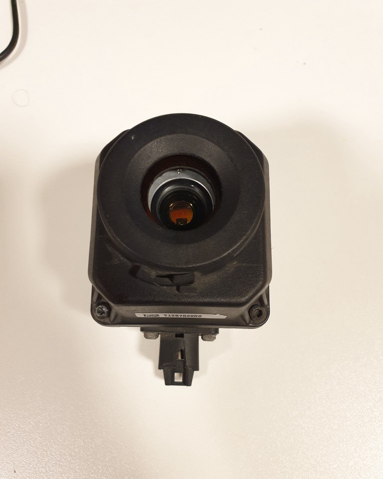
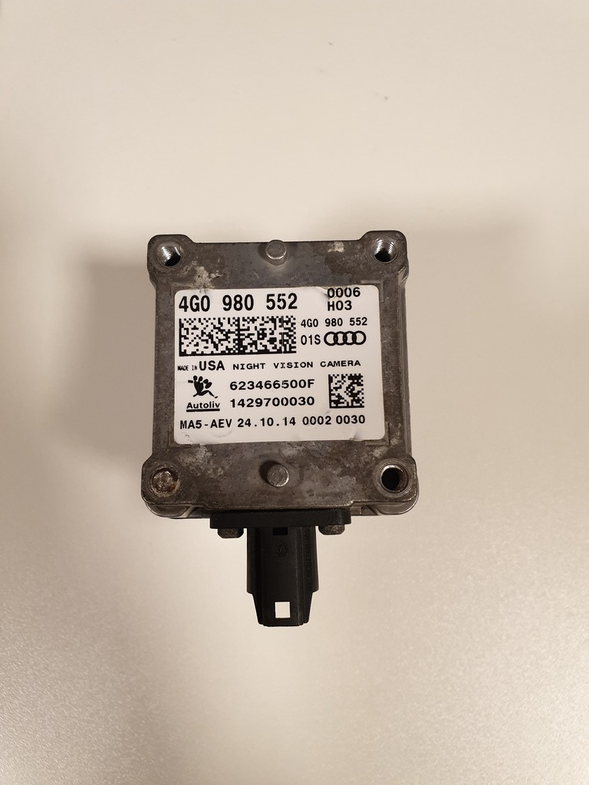
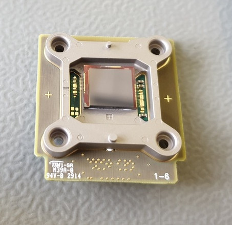
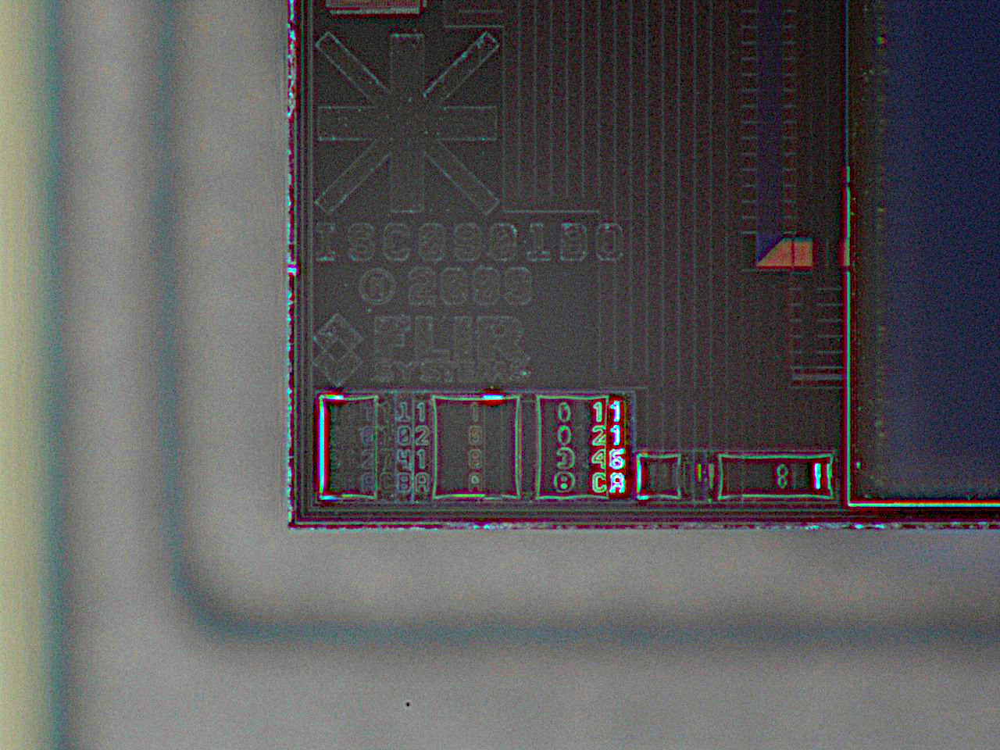
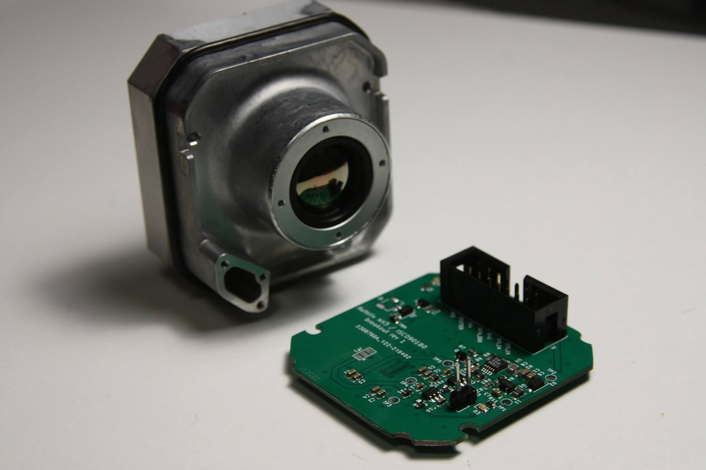

# ISC0901B0 breakout board

ISC0901B0 is 336x256 microbolometer LWIR sensor manufactured by FLIR. 
Apparently it is being used in Tau2/Vue series camera cores, as well as many other FLIR products. 
Autoliv NV3 is also based on this sensor, and buying a second-hand, possibly damaged Autoliv NV3 module is probably the cheapest way to obtain such a sensor.

This breakout board connects directly to sensor and provides all the neccessary signals on 14-pin 2.54mm pin header (or IDC header).
It also generates the three required power rails: 2.5V for IO signals, 3.3V for core power and switchable 9/11V bias voltage.
Breakout board input voltage: 5V.
Sensor power consumption (incl. Iq of step-up convertor and LDO losses): approx 60-65mA at 5V input to breakout board.

# Sensor physical interface

All the signals described below are single ended, at VCC_IO of the sensor (2.5V in the Autoliv NV3).

**-> CLK:** clock for the sensor (nominal 73.636MHz for 60Hz). Sampling at other frequencies works, but the image is over/under exposed, as the CMD presumably configures the sensor for particular integration time.

**-> CMD:** synchronous command to sensor (output on rising edge). Bit order: MSB first. 

**-> BIAS:** synchronous bias data value to sensor. Each bias value is 7-bits long, so there is a value for each pixel. Bit order: LSB first

**-> ENA:** enable signal to sensor (?). High = sensor enabled, low = sensor disabled.

**<- DATA_0, DATA_1:** two data bits from sensor (output on falling edge, presumably sampled on rising). Each of the data lines represents a separate pixel. Bit order: LSB first.

# Startup sequence of Autoliv NV3

Measured without sensor:

1. all outputs low
2. start clk
3. 500uS delay
4. enable VCC_CORE (3.3V)
5. 15ms delay
6. enable VCC_IO (2.5V)
7. 4ms delay
8. enable VCC_BIAS (11.0V)

BIAS voltage at turn on = 11.0V

# Logical interface

After powerup sequence is finished, sensor needs to be enabled. 
Frame acquisition starts by sending a command preamble that consists of two bytes: [0x3f, 0xc0]. After that, a 20 byte sequence, of which several bytes seem to be specific to each sensor are sent.
After predetermined number of clock cycles, sensor starts responding with preamble 0x1555 on both data lines (repeating pattern of zeroes and ones).

One cycle after the sensor has started responding with preamble, bias values should be sent to sensor on the bias line: one 7-bit value for every pixel. The values are specific to each sensor: if a fixed value is sent, part of the pixels may appear to be non-responsive.
After preamble (two pixels), sensor sends the subsequent 336 pixels of image data. There is a horizontal blanking period after each line.
At the end of the readout (~256 lines), command must be sent again to initate sensor response.

The specific values for command and bias values appear to be stored in the encrypted regions of flash memory on Autoliv NV3. Further research is needed to determine if it's feasible to come up with
these values without access to flash memory contents of Autoliv NV3.

## Version history
* rev1 of this breakout board has been verified on Audi 4G0980552. 
  Observed issues: 
  * even with disabled boost converter, current path was provided by inductor.
  * outline of the PCB was slightly too large and did not fit the enclosure.
* rev2: fix problems mentioned above

**Important note:** the 2.54mm header with just a single ground pin is very poor choice for an interface that runs at ~73MHz. It does work with ~5cm long cable though, but it's recommended to change to a different connector and add several more ground pins.
